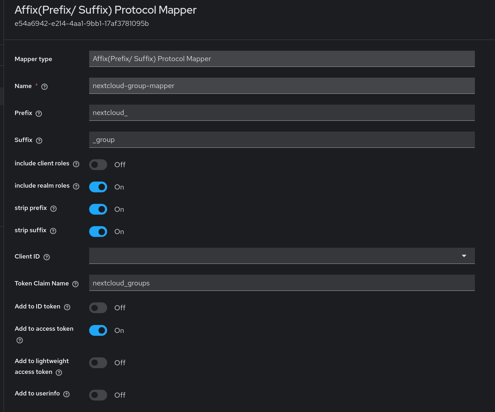

# Keycloak-Affix-Role-Protocol-Mapper

OIDC Prefix / Suffix Protocol Mapper for Keycloak. 
It allows filtering (client and/ or realm) roles to a claim based on their prefix and or suffix and optionally stripping them. 

e.g.

and a user that among others contains the roles:
* `nextcloud_admin_group`
* `nextcloud_family_group`
* `nextcloud_user`
results in claim
```yaml
  "nextcloud_groups": [
    "admin",
    "family"
  ],
```


## use

Add it to Keycloak, e.g. by adding to a configmap.

e.g. via Kustomize:
```yaml

configMapGenerator:
  - name: affix-role-protocol-mapper
    files:
      - https://github.com/Stefanqn/KeycloakAffixProtocolMapper/releases/download/v0.0.2/affix-role-protocol-mapper.jar # unknown renovate detection
```
or via `kubectl`: 
```bash
kubectl create configmap affix-role-protocol-mapper --namespace keycloak  --from-file=./lib/build/libs/affix-role-protocol-mapper.jar --dry-run=client -o yaml | kubectl apply -f -
```

Map it to Keycloak via its operator:
```yaml
  unsupported:
    podTemplate:
      spec:
        containers:
          - name: keycloak
            volumeMounts:
              - name: affix-role-protocol-mapper
                mountPath: /opt/keycloak/providers/affix-role-protocol-mapper.jar
                subPath: affix-role-protocol-mapper.jar
        volumes:
          - name: affix-role-protocol-mapper
            configMap:
              name: affix-role-protocol-mapper
```

Configure it, e.g. via Terraform: 
```terraform
resource "keycloak_generic_protocol_mapper" "affix_role_protocol_mapper" {
  realm_id        = keycloak_realm.main.id
  client_scope_id = keycloak_openid_client_scope.nextcloud_client_scope.id
  name            = "nextcloud group mapper"
  protocol        = "openid-connect"
  protocol_mapper = "oidc-affix-role-protocol-mapper"
  config          = {
    "claim.name"                = "nextcloud_groups"
    "multivalued"               = "true"
    "prefix"                    = "nextcloud_"
    "suffix"                    = "_group"
    "access.token.claim"        = "true"
    "introspection.token.claim" = "true"
    "id.token.claim"            = "false"
    "include-client-roles"      = "false"
    "include-realm-roles"       = "false"
    "lightweight.claim"         = "false"
    "strip-prefix"              = "false"
    "strip-suffix"              = "false"
    "userinfo.token.claim"      = "false"
  }
}
```

## Dev
### Github Release
`gh release create v0.0.1 --title "0.0.1" --notes "initial release"`
### Deploy to k8s
`kubectl create configmap affix-mapper --namespace keycloak  --from-file=./lib/build/libs/affix-protocol-mapper.jar --dry-run=client -o yaml | kubectl apply -f -`

## Tests (TODO)
add tests, e.g. with a [keycloak testcontainer](https://github.com/dasniko/testcontainers-keycloak) and its [kotest extension](https://github.com/kotest/kotest-extensions-testcontainers)

